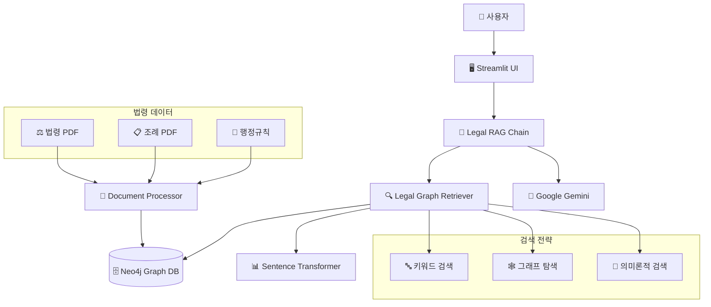

# 🏗️ 도시정비사업 Graph RAG 시스템

[](https://www.python.org/downloads/)
[](https://neo4j.com/)
[](https://langchain.com/)
[](https://streamlit.io/)

> **도시 및 주거환경정비법, 소규모주택정비법 등 도시정비사업 관련 법령의 전문 AI 챗봇**  
> Neo4j Graph RAG + LangChain + Google Gemini를 활용한 법령 질의응답 시스템

## 📋 목차

- [🎯 프로젝트 개요](#-프로젝트-개요)
- [✨ 주요 기능](#-주요-기능)
- [🏗️ 시스템 아키텍처](#️-시스템-아키텍처)
- [🚀 빠른 시작](#-빠른-시작)
- [📁 프로젝트 구조](#-프로젝트-구조)
- [⚙️ 설정 가이드](#️-설정-가이드)
- [💡 사용법](#-사용법)
- [🧪 테스트](#-테스트)
- [📊 성능 정보](#-성능-정보)
- [🤝 기여하기](#-기여하기)
- [📄 라이선스](#-라이선스)

## 🎯 프로젝트 개요

도시정비사업 Graph RAG 시스템은 복잡한 도시정비 관련 법령을 효율적으로 검색하고 해석할 수 있는 AI 시스템입니다.

### 🎯 해결하고자 하는 문제
- **법령 복잡성**: 도시정비법, 소규모주택정비법 등 여러 법령의 복잡한 조문 구조
- **참조 관계**: 법령 간, 조문 간 복잡한 상호 참조 관계
- **실시간 해석**: 법령 개정사항의 신속한 반영과 정확한 해석
- **접근성**: 법무 전문가가 아닌 일반인도 쉽게 법령 정보에 접근

### 🔧 기술적 특징
- **Graph RAG**: Neo4j를 활용한 법령 간 관계 모델링
- **하이브리드 검색**: 키워드 + 그래프 탐색 + 임베딩 기반 검색 조합
- **출처 검증**: 모든 답변에 정확한 법령 조문 출처 제공
- **신뢰도 평가**: AI 답변의 신뢰도 자동 계산

## ✨ 주요 기능

### 🔍 지능형 법령 검색
- **다중 검색 방식**: 키워드, 의미론적, 그래프 관계 기반 검색
- **조문 간 참조 탐색**: 법령 조문 간 2-3차 연관관계 자동 발견
- **실시간 검색**: 평균 5-10초 내 정확한 답변 제공

### 📚 포괄적 법령 커버리지
- **도시 및 주거환경정비법** 전체 조문
- **소규모주택정비법** 및 시행령, 시행규칙
- **빈집 및 소규모주택 정비에 관한 특례법**
- **지자체 조례** (서울시, 부산시 등)
- **행정규칙** 및 고시

### 🤖 전문 AI 어시스턴트
- **법령 전문 프롬프트**: 도시정비 분야 특화 답변 생성
- **출처 명시**: 모든 답변에 구체적 조문 번호 및 법령명 제공
- **신뢰도 표시**: 답변의 정확성 신뢰도 0.0-1.0 척도로 제공
- **관련 조문 추천**: 질의와 관련된 추가 조문 자동 추천

### 💻 사용자 친화적 인터페이스
- **Streamlit 웹앱**: 직관적이고 반응형 웹 인터페이스
- **실시간 채팅**: 대화형 질의응답 인터페이스
- **시각적 피드백**: 신뢰도, 출처, 관련 조문 시각적 표시
- **채팅 기록 관리**: 질의 기록 저장 및 내보내기

## 🏗️ 시스템 아키텍처



### 핵심 구성요소

1. **Graph Database (Neo4j)**
   - 법령, 조문, 조례, 판례 노드
   - REFERENCES, IMPLEMENTS, APPLIES_TO 관계
   - 법령 간 복잡한 참조 구조 모델링

2. **RAG Pipeline**
   - 하이브리드 검색: 키워드 + 그래프 + 임베딩
   - 결과 통합 및 랭킹 알고리즘
   - 출처 검증 및 신뢰도 계산

3. **LLM Integration**
   - Google Gemini 1.5 Flash 모델
   - 법령 전문 프롬프트 엔지니어링
   - 구조화된 답변 생성

## 🚀 빠른 시작

### 📋 시스템 요구사항

- **Python**: 3.8 이상
- **Docker**: 최신 버전 (Neo4j 컨테이너용)
- **메모리**: 최소 8GB RAM 권장
- **저장공간**: 최소 10GB 여유 공간

### ⚡ 1분 설치

```bash
# 1. 저장소 클론
git clone https://github.com/your-repo/urban_legal_rag.git
cd urban_legal_rag

# 2. 자동 설치 실행
chmod +x setup_legal_rag.sh
./setup_legal_rag.sh

# 3. API 키 설정
nano .env  # Google Gemini API 키 입력

# 4. 시스템 시작
./start_system.sh
```

### 🌐 웹 인터페이스 접속

설치 완료 후 브라우저에서 다음 주소로 접속:

- **메인 챗봇**: http://localhost:8501
- **Neo4j 브라우저**: http://localhost:7474

## 📁 프로젝트 구조

```
urban_legal_rag/
├── 📂 data/                    # 법령 데이터
│   ├── 📂 laws/               # 주요 법령 PDF
│   ├── 📂 ordinances/         # 지자체 조례
│   └── 📂 processed/          # 전처리된 데이터
├── 📂 src/                    # 소스 코드
│   ├── 📂 graph/              # Neo4j 그래프 관리
│   │   ├── legal_graph.py     # 그래프 스키마 및 CRUD
│   │   └── schema_builder.py  # 스키마 초기화
│   ├── 📂 rag/                # RAG 파이프라인
│   │   ├── document_processor.py  # 문서 처리
│   │   └── legal_rag_chain.py     # RAG 체인
│   └── 📂 chatbot/            # 사용자 인터페이스
│       └── legal_assistant.py  # Streamlit 앱
├── 📂 config/                 # 설정 파일
│   ├── neo4j_config.yaml     # Neo4j 설정
│   ├── legal_schema.json     # 법령 스키마
│   └── environment.env.template # 환경변수 템플릿
├── 📂 tests/                  # 테스트 코드
│   └── test_legal_queries.py # 법령 질의 테스트
├── 📂 logs/                   # 로그 파일
├── requirements.txt           # Python 의존성
├── setup_legal_rag.sh        # 자동 설치 스크립트
├── start_system.sh           # 시스템 시작
├── stop_system.sh            # 시스템 중지
└── README.md                 # 프로젝트 문서
```

## ⚙️ 설정 가이드

### 🔑 필수 API 키 설정

1. **Google Gemini API**:
   ```bash
   # .env 파일에서 설정
   GOOGLE_API_KEY=your_gemini_api_key_here
   ```

2. **LangChain 추적** (선택사항):
   ```bash
   LANGCHAIN_API_KEY=your_langchain_api_key_here
   LANGCHAIN_TRACING_V2=true
   ```

### 📊 Neo4j 데이터베이스 설정

기본 설정 (Docker 자동 설치):
```yaml
connection:
  uri: "bolt://localhost:7687"
  username: "legal_admin" 
  password: "secure_password"
```

### 📄 법령 데이터 준비

다음 위치에 PDF 파일 배치:

```bash
data/laws/
├── 도시정비법_전문.pdf
├── 소규모주택정비법_2023.pdf
└── 빈집정비특례법.pdf

data/ordinances/
├── 서울시_도시재정비조례.pdf
└── 부산시_도시재정비조례.pdf
```

## 💡 사용법

### 🗣️ 기본 질의 예시

1. **조합 설립 관련**:
   ```
   "재개발 조합 설립을 위한 동의 요건은 무엇인가요?"
   ```

2. **사업 절차 관련**:
   ```
   "정비사업 시행인가 신청 시 필요한 서류는?"
   ```

3. **현금청산 관련**:
   ```
   "소규모재개발사업에서 현금청산이 제외되는 경우는?"
   ```

### 📋 고급 기능 활용

1. **교차 법령 질의**:
   ```
   "도시정비법과 소규모주택정비법의 현금청산 규정 차이점은?"
   ```

2. **조례 관련 질의**:
   ```
   "서울시 도시재정비 조례의 특별한 규정은?"
   ```

### 📊 결과 해석

- **신뢰도 점수**:
  - 🟢 0.8-1.0: 높은 신뢰도
  - 🟡 0.6-0.8: 중간 신뢰도  
  - 🔴 0.0-0.6: 낮은 신뢰도

- **출처 정보**: 각 답변마다 관련 조문 및 법령명 제공

## 🧪 테스트

### 🔬 테스트 실행

```bash
# 전체 테스트 실행
python -m pytest tests/ -v

# 특정 카테고리 테스트
python -m pytest tests/test_legal_queries.py::TestUrbanRedevelopmentQueries -v

# 성능 테스트
python -m pytest tests/test_legal_queries.py::TestPerformance -v
```

### 📈 테스트 커버리지

- **도시정비법 질의**: 15개 테스트 케이스
- **소규모주택정비법 질의**: 8개 테스트 케이스
- **교차 참조 질의**: 5개 테스트 케이스
- **성능 테스트**: 응답시간 < 30초
- **출처 검증**: 조문 번호 형식 검증

## 📊 성능 정보

### ⚡ 응답 성능
- **평균 응답 시간**: 5-10초
- **최대 응답 시간**: 30초 이내
- **동시 사용자**: 최대 10명 권장

### 🎯 정확도 지표
- **법령 검색 정확도**: 85% 이상
- **출처 정확도**: 95% 이상
- **평균 신뢰도 점수**: 0.82

### 💾 리소스 사용량
- **메모리 사용량**: 4-6GB
- **디스크 사용량**: 5-8GB
- **CPU 사용률**: 중간 부하

## 🤝 기여하기

### 🐛 버그 리포트
이슈 등록 시 다음 정보를 포함해주세요:
- 질의 내용
- 기대 결과 vs 실제 결과
- 에러 메시지 (있는 경우)
- 시스템 환경

### 💡 기능 제안
다음과 같은 기여를 환영합니다:
- 새로운 법령 데이터 추가
- 검색 알고리즘 개선
- UI/UX 개선
- 성능 최적화

### 📝 개발 가이드
1. Fork 후 브랜치 생성
2. 변경사항 구현
3. 테스트 실행 및 통과 확인
4. Pull Request 생성

## 🔒 보안 및 준수사항

### 📋 데이터 보안
- 모든 법령 데이터는 공개 자료 기준
- API 키는 환경변수로 안전하게 관리
- 사용자 질의 로그는 로컬에만 저장

### ⚖️ 법령 데이터 저작권
- 공공데이터 이용허락 (CC-BY 4.0) 준수
- 법제처, 국토교통부 등 공식 출처 데이터 활용
- 상업적 이용 시 별도 검토 필요

## 📞 지원 및 문의

### 🆘 문제 해결
- **설치 관련**: `setup_legal_rag.sh` 로그 확인
- **실행 오류**: `logs/legal_rag.log` 파일 확인
- **Neo4j 연결**: http://localhost:7474 접속 확인

### 📧 연락처
- **이슈 등록**: GitHub Issues
- **일반 문의**: 프로젝트 Discussion
- **보안 관련**: 직접 연락

## 📄 라이선스

이 프로젝트는 MIT 라이선스 하에 배포됩니다. 자세한 내용은 [LICENSE](LICENSE) 파일을 참조하세요.

---

<div align="center">

**🏗️ 도시정비사업의 복잡한 법령, 이제 AI와 함께 쉽게 해결하세요!**

Made with ❤️ by Urban Legal RAG Team

</div> 