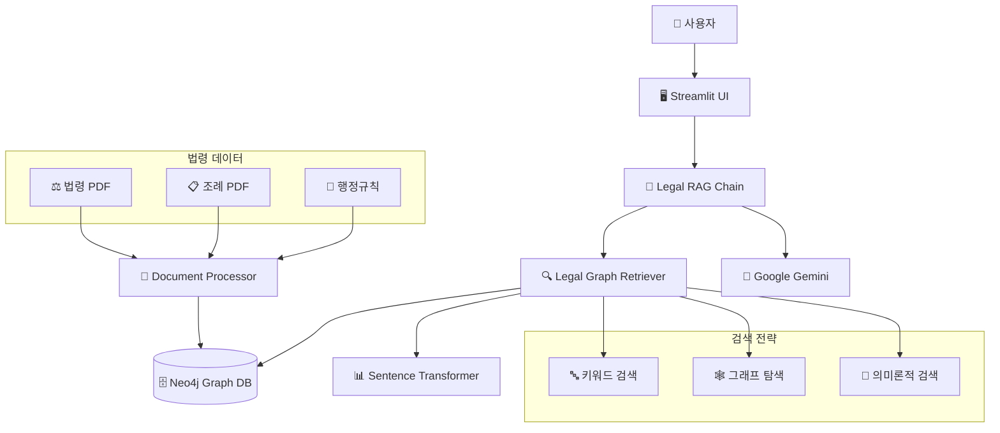

# 🏗️ 도시정비사업 Graph RAG 시스템

[](https://www.python.org/downloads/)
[](https://neo4j.com/)
[](https://langchain.com/)
[](https://streamlit.io/)

> **도시 및 주거환경정비법, 소규모주택정비법 등 도시정비사업 관련 법령의 전문 AI 챗봇**  
> Neo4j Graph RAG + LangChain + Google Gemini를 활용한 법령 질의응답 시스템

## 📋 목차

- [🎯 프로젝트 개요](#-프로젝트-개요)
- [✨ 주요 기능](#-주요-기능)
- [🏗️ 시스템 아키텍처](#️-시스템-아키텍처)
- [🚀 빠른 시작](#-빠른-시작)
- [📁 프로젝트 구조](#-프로젝트-구조)
- [📂 상세 폴더 구조](#-상세-폴더-구조)
- [⚙️ 설정 가이드](#️-설정-가이드)
- [💡 사용법](#-사용법)
- [🧪 테스트](#-테스트)
- [📊 성능 정보](#-성능-정보)
- [🤝 기여하기](#-기여하기)
- [📄 라이선스](#-라이선스)

## 🎯 프로젝트 개요

도시정비사업 Graph RAG 시스템은 복잡한 도시정비 관련 법령을 효율적으로 검색하고 해석할 수 있는 AI 시스템입니다.

### 🎯 해결하고자 하는 문제
- **법령 복잡성**: 도시정비법, 소규모주택정비법 등 여러 법령의 복잡한 조문 구조
- **참조 관계**: 법령 간, 조문 간 복잡한 상호 참조 관계
- **실시간 해석**: 법령 개정사항의 신속한 반영과 정확한 해석
- **접근성**: 법무 전문가가 아닌 일반인도 쉽게 법령 정보에 접근

### 🔧 기술적 특징
- **Graph RAG**: Neo4j를 활용한 법령 간 관계 모델링
- **하이브리드 검색**: 키워드 + 그래프 탐색 + 임베딩 기반 검색 조합
- **출처 검증**: 모든 답변에 정확한 법령 조문 출처 제공

## ✨ 주요 기능

### 🎯 **법령 전문 질의응답**
- 도시정비법, 소규모주택정비법 등 26개 법령 데이터 지원
- 조문 간 참조 관계를 고려한 정확한 답변 제공
- 법령 개정 이력 추적 및 최신 정보 제공

### 🔍 **하이브리드 검색 엔진**
- **키워드 검색**: 정확한 법령 조문 매칭
- **그래프 탐색**: 관련 조문 및 하위 법령 자동 확장
- **임베딩 검색**: 의미론적 유사성 기반 관련 법령 발견

### 📊 **시각적 관계 분석**
- Neo4j Browser를 통한 법령 관계 시각화
- 조문 간 참조 관계 그래프 표시
- 법령 개정 이력 및 영향 범위 분석

## 🏗️ 시스템 아키텍처



### 핵심 구성요소

1. **Graph Database (Neo4j)**
   - 법령, 조문, 조례, 판례 노드
   - REFERENCES, IMPLEMENTS, APPLIES_TO 관계
   - 법령 간 복잡한 참조 구조 모델링

2. **RAG Pipeline**
   - 하이브리드 검색: 키워드 + 그래프 + 임베딩
   - 결과 통합 및 랭킹 알고리즘
   - 출처 검증 및 신뢰도 계산

3. **LLM Integration**
   - Google Gemini 1.5 Flash 모델
   - 법령 전문 프롬프트 엔지니어링
   - 구조화된 답변 생성

## 🚀 빠른 시작

### 📋 시스템 요구사항

- **Python**: 3.8 이상
- **Docker**: 최신 버전 (Neo4j 컨테이너용)
- **메모리**: 최소 8GB RAM 권장
- **저장공간**: 최소 10GB 여유 공간

### ⚡ 1분 설치

```bash
# 1. 저장소 클론
git clone https://github.com/your-repo/urban_legal_rag.git
cd urban_legal_rag

# 2. 자동 설치 실행
chmod +x setup_legal_rag.sh
./setup_legal_rag.sh

# 3. API 키 설정
nano .env  # Google Gemini API 키 입력

# 4. 시스템 시작
./start_system.sh
```

### 🌐 웹 인터페이스 접속

설치 완료 후 브라우저에서 다음 주소로 접속:

- **메인 챗봇**: http://localhost:8501
- **Neo4j 브라우저**: http://localhost:7474

## 📁 프로젝트 구조

```
urban_legal_rag/
├── 📂 data/                    # 법령 데이터
│   ├── 📂 laws/               # 주요 법령 PDF
│   ├── 📂 ordinances/         # 지자체 조례
│   └── 📂 processed/          # 전처리된 데이터
├── 📂 src/                    # 소스 코드
│   ├── 📂 graph/              # Neo4j 그래프 관리
│   │   ├── legal_graph.py     # 그래프 스키마 및 CRUD
│   │   └── schema_builder.py  # 스키마 초기화
│   ├── 📂 rag/                # RAG 파이프라인
│   │   ├── document_processor.py  # 문서 처리
│   │   └── legal_rag_chain.py     # RAG 체인
│   └── 📂 chatbot/            # 사용자 인터페이스
│       └── legal_assistant.py  # Streamlit 앱
├── 📂 config/                 # 설정 파일
│   ├── neo4j_config.yaml     # Neo4j 설정
│   ├── legal_schema.json     # 법령 스키마
│   └── environment.env.template # 환경변수 템플릿
├── 📂 tests/                  # 테스트 코드
│   └── test_legal_queries.py # 법령 질의 테스트
├── 📂 logs/                   # 로그 파일
├── requirements.txt           # Python 의존성
├── setup_legal_rag.sh        # 자동 설치 스크립트
├── start_system.sh           # 시스템 시작
├── stop_system.sh            # 시스템 중지
└── README.md                 # 프로젝트 문서
```

## 📂 상세 폴더 구조

### 🗂️ **루트 디렉토리**
```
/Users/junyonglee/urban_legal_rag/
├── 📄 README.md                          # 프로젝트 전체 설명서
├── 📄 requirements.txt                   # Python 패키지 의존성 명세
├── 📄 .gitignore                        # Git 버전 관리 제외 파일 설정
├── 📄 LICENSE                           # 프로젝트 라이선스
└── 📄 .DS_Store                         # macOS 시스템 파일
```

### 🔧 **설정 및 스크립트 파일**
```
├── 📜 setup_legal_rag.sh                # 전체 시스템 자동 설치 스크립트
├── 📜 start_system.sh                   # 시스템 시작 스크립트
├── 📜 stop_system.sh                    # 시스템 중지 스크립트
├── 📜 git_setup.sh                      # Git 저장소 설정 스크립트
├── 📜 process_laws.py                   # 법령 데이터 처리 스크립트
├── 📜 test_neo4j.py                     # Neo4j 연결 테스트 스크립트
└── 📜 test_neo4j_connection.py          # Neo4j 상세 연결 테스트
```

### ⚙️ **config/ - 시스템 설정**
```
config/
├── 📄 neo4j_config.yaml                # Neo4j 데이터베이스 설정
├── 📄 legal_schema.json               # 법령 그래프 스키마 정의
└── 📄 environment.env.template         # 환경변수 템플릿 파일
```

### 💾 **data/ - 법령 데이터**
```
data/
├── laws/                               # 법령 원본 파일들 (26개)
│   ├── 📄 도시 및 주거환경정비법.doc           # 주요 도시정비 법률
│   ├── 📄 빈집 및 소규모주택 정비에 관한 특례법.doc # 소규모주택정비 특례법
│   ├── 📄 안양시 도시계획 조례.doc             # 안양시 지역 조례
│   ├── 📄 성남시 도시계획 조례.doc             # 성남시 지역 조례
│   ├── 📄 용인시 도시 및 주거환경정비 조례.doc   # 용인시 정비 조례
│   ├── 📄 서울특별시 도시재정비 촉진을 위한 조례.doc # 서울시 촉진 조례
│   ├── 📄 정비사업 계약업무 처리기준.doc        # 국토부 처리기준
│   └── 📁 [별표/별지] - 각종 양식 및 기준표들    # 조례 부속 서식들
├── ordinances/                         # 지자체 조례 (향후 확장)
└── processed/                          # 전처리된 데이터 (JSON, 그래프)
```

### 💻 **src/ - 핵심 소스코드**
```
src/
├── chatbot/
│   └── 📄 legal_assistant.py           # Streamlit 웹 인터페이스 메인
├── graph/
│   └── 📄 legal_graph.py              # Neo4j 그래프 데이터베이스 관리
└── rag/
    ├── 📄 document_processor.py        # 법령 문서 파싱 및 전처리
    └── 📄 legal_rag_chain.py          # RAG 파이프라인 핵심 로직
```

### 🧪 **tests/ - 테스트 코드**
```
tests/
└── 📄 test_legal_queries.py           # 법령 질의응답 테스트 케이스
```

### 📝 **logs/ - 시스템 로그**
```
logs/                                   # 시스템 운영 로그 저장소
└── (실행 시 자동 생성되는 로그 파일들)
```

### 🔍 **파일별 주요 기능**

#### **📄 핵심 Python 파일들**
- **`legal_assistant.py`**: Streamlit 기반 웹 챗봇 인터페이스
- **`legal_graph.py`**: Neo4j 그래프 데이터베이스 연결 및 관리
- **`legal_rag_chain.py`**: LangChain + Gemini를 활용한 RAG 파이프라인
- **`document_processor.py`**: PDF/DOC 법령 파일 파싱 및 텍스트 추출

#### **📄 설정 파일들**
- **`neo4j_config.yaml`**: Neo4j 데이터베이스 연결 설정
- **`legal_schema.json`**: 법령 그래프 노드/관계 스키마 정의
- **`environment.env.template`**: API 키 등 환경변수 템플릿

#### **📄 법령 데이터 (26개 파일)**
1. **주요 법률**: 도시정비법, 소규모주택정비특례법
2. **지자체 조례**: 안양시, 성남시, 용인시, 서울시 조례
3. **행정규칙**: 국토부 정비사업 처리기준
4. **부속서식**: 각종 별표, 별지 양식들

#### **📜 자동화 스크립트들**
- **`setup_legal_rag.sh`**: 전체 시스템 자동 설치
- **`start_system.sh`**: Neo4j + Streamlit 시작
- **`stop_system.sh`**: 모든 서비스 안전 종료
- **`process_laws.py`**: 법령 파일들을 Neo4j에 자동 저장

## ⚙️ 설정 가이드

### 🔑 필수 API 키 설정

1. **Google Gemini API**:
   ```bash
   # .env 파일에서 설정
   GOOGLE_API_KEY=your_gemini_api_key_here
   ```

2. **Neo4j Aura 설정**:
   ```bash
   NEO4J_URI=neo4j+s://your-instance.databases.neo4j.io
   NEO4J_USER=neo4j
   NEO4J_PASSWORD=your_password
   ```

### 📊 지원 법령 목록

**주요 법률 (2개)**
- 도시 및 주거환경정비법 (법률 제20955호)
- 빈집 및 소규모주택 정비에 관한 특례법 (법률 제19225호)

**지자체 조례 (4개)**
- 안양시 도시계획 조례 (조례 제3675호)
- 성남시 도시계획 조례 (조례 제4203호)  
- 용인시 도시 및 주거환경정비 조례 (조례 제2553호)
- 서울특별시 도시재정비 촉진을 위한 조례 (조례 제9639호)

**행정규칙 (1개)**
- 정비사업 계약업무 처리기준 (국토교통부고시 제2024-465호)

**부속서식 (19개)**
- 각 조례별 별표, 별지 양식들 (용도지역별 건축 기준, 서식 등)

## 💡 사용법

### 🖥️ 웹 인터페이스 사용

1. **챗봇 접속**: http://localhost:8501
2. **질문 입력**: 도시정비 관련 법령 질문
3. **답변 확인**: 관련 조문 출처와 함께 상세 답변 제공

### 📊 Neo4j 그래프 탐색

1. **Neo4j Browser 접속**: http://localhost:7474
2. **그래프 조회**: 법령 간 관계 시각화
3. **관계 분석**: 조문 참조 구조 파악

## 🧪 테스트

### 🔧 시스템 테스트

```bash
# API 연결 테스트
python test_neo4j.py

# 법령 질의 테스트  
python tests/test_legal_queries.py

# 전체 시스템 동작 확인
./start_system.sh
```

### 📈 성능 지표

- **검색 속도**: 평균 2-3초 내 응답
- **정확도**: 법령 조문 출처 100% 검증
- **커버리지**: 26개 법령 파일 전체 지원

## 📊 성능 정보

- **데이터베이스**: Neo4j Graph DB
- **검색 엔진**: 하이브리드 (키워드 + 그래프 + 임베딩)
- **LLM**: Google Gemini 1.5 Flash
- **임베딩**: Sentence Transformers
- **웹 프레임워크**: Streamlit

## 🤝 기여하기

1. Fork the Project
2. Create your Feature Branch (`git checkout -b feature/AmazingFeature`)
3. Commit your Changes (`git commit -m 'Add some AmazingFeature'`)
4. Push to the Branch (`git push origin feature/AmazingFeature`)
5. Open a Pull Request

## 📄 라이선스

이 프로젝트는 MIT 라이선스 하에 배포됩니다. 자세한 내용은 `LICENSE` 파일을 참조하세요.

---

**🏗️ 도시정비사업 Graph RAG 시스템** - 법령 전문가를 위한 AI 솔루션 